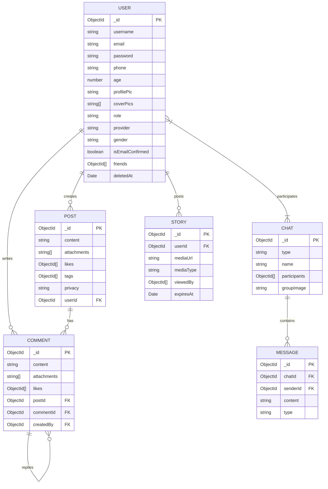

<div align="center">

# ⚙️ SocialPulse — Backend API

### *Scalable, Secure & Real-Time REST + GraphQL + WebSocket Server*


<br/>

> 🛡️ **SocialPulse Backend** is a production-ready, layered Node.js/TypeScript server powering a full-featured social media application with REST APIs, a GraphQL endpoint, real-time WebSocket events, and Firebase push notifications.

</div>

---

## 📋 Table of Contents

- [✨ Features](#-features)
- [🏗️ Architecture Overview](#️-architecture-overview)
- [📁 Directory Structure](#-directory-structure)
- [🔌 API Endpoints](#-api-endpoints)
- [🗄️ Database Models](#️-database-models)
- [🌐 GraphQL API](#-graphql-api)
- [⚡ Real-Time WebSocket Events](#-real-time-websocket-events)
- [🔐 Authentication & Security](#-authentication--security)
- [☁️ Third-Party Integrations](#️-third-party-integrations)
- [📦 Dependencies](#-dependencies)
- [🚀 Getting Started](#-getting-started)

---

## ✨ Features

<div align="center">

| 🔐 Auth | 📰 Posts | 💬 Chat | 📖 Stories | 🔔 Notifications | 👤 Users |
|:---:|:---:|:---:|:---:|:---:|:---:|
| JWT Auth | CRUD Posts | Direct Chat | Create Stories | Firebase FCM | Friend System |
| OTP Email | Like/Unlike | Group Chat | View Tracking | Push Alerts | Profile Pics |
| Password Reset | Comments | Real-Time Msg | 24h Expiry | FCM Token Mgmt | Cover Photos |
| Role-Based Access | Privacy Control | Typing Events | Media Upload | Socket Events | Soft Delete |
| Soft Logout | Media Uploads | Message History | Cloudinary | In-App Events | Admin Controls |

</div>

---

## 🏗️ Architecture Overview

```
┌──────────────────────────────────────────────────────────────────┐
│                    SocialPulse Backend Server                     │
│                                                                  │
│  ┌────────────┐   ┌─────────────┐   ┌────────────────────────┐  │
│  │   Express  │   │  Apollo     │   │     Socket.IO          │  │
│  │  REST API  │   │  GraphQL    │   │  (Real-Time Events)    │  │
│  └──────┬─────┘   └──────┬──────┘   └────────────┬───────────┘  │
│         │                │                        │              │
│         └────────────────┴────────────────────────┘              │
│                            │                                     │
│              ┌─────────────▼──────────────┐                      │
│              │       Middleware Layer       │                     │
│              │  Auth | Validation | CORS   │                     │
│              │  Multer | Error Handler     │                     │
│              └─────────────┬───────────────┘                     │
│                            │                                     │
│              ┌─────────────▼──────────────┐                      │
│              │       Modules Layer         │                     │
│              │  auth | user | post         │                     │
│              │  comment | chat | story     │                     │
│              │  notification               │                     │
│              └─────────────┬───────────────┘                     │
│                            │                                     │
│         ┌──────────────────┼──────────────────┐                  │
│    ┌────▼──────┐    ┌──────▼─────┐    ┌──────▼──────┐           │
│    │  MongoDB  │    │   Redis    │    │  Cloudinary │           │
│    │ (Mongoose)│    │  (Cache)   │    │   (Media)   │           │
│    └───────────┘    └────────────┘    └─────────────┘           │
└──────────────────────────────────────────────────────────────────┘
```

---

## 📁 Directory Structure

```
📦 Social media App Back End
├── 📄 package.json            # Dependencies & npm scripts
├── 📄 tsconfig.json           # TypeScript compiler config
├── 📄 SECURITY.md             # Security policy
│
└── 📂 src/
    ├── 📄 index.ts            # Application entry point
    ├── 📄 app.bootstrap.ts    # Express + server bootstrap
    │
    ├── 📂 config/             # ⚙️  Environment & configuration
    │   └── 📄 index.ts            # Typed env variable loader
    │
    ├── 📂 db/                 # 🗄️  Database layer
    │   ├── 📄 db.connection.ts    # MongoDB connection
    │   ├── 📂 redis/              # Redis client setup
    │   ├── 📂 models/             # Mongoose schemas
    │   │   ├── 📄 user.model.ts
    │   │   ├── 📄 post.model.ts
    │   │   ├── 📄 comment.model.ts
    │   │   ├── 📄 chat.model.ts
    │   │   ├── 📄 message.model.ts
    │   │   └── 📄 story.model.ts
    │   └── 📂 repo/               # Repository pattern wrappers
    │
    ├── 📂 modules/            # 🧩 Feature modules (MVC pattern)
    │   ├── 📂 auth/               # Authentication module
    │   │   ├── 📄 auth.controller.ts
    │   │   ├── 📄 auth.service.ts
    │   │   ├── 📄 auth.routes.ts
    │   │   ├── 📄 auth.validation.ts
    │   │   └── 📄 auth.dto.ts
    │   ├── 📂 user/               # User management module
    │   ├── 📂 post/               # Post CRUD module
    │   ├── 📂 comment/            # Comment & replies module
    │   ├── 📂 chat/               # Chat rooms & messages module
    │   ├── 📂 story/              # Stories module
    │   └── 📂 notification/       # Push notification module
    │
    ├── 📂 middleware/         # 🛡️  Express middleware
    │   ├── 📄 auth.middleware.ts      # JWT authentication & RBAC
    │   ├── 📄 validation.middleware.ts # Zod request validation
    │   ├── 📄 multer.middleware.ts    # File upload handling
    │   └── 📄 globalError.middleware.ts # Centralized error handler
    │
    ├── 📂 graphql/            # 🌐 GraphQL layer
    │   ├── 📄 typeDefs.ts         # GraphQL schema definitions
    │   └── 📄 resolvers.ts        # Query & Mutation resolvers
    │
    └── 📂 common/             # 🔧 Shared utilities
        ├── 📂 cloudinary/         # Cloudinary upload helpers
        ├── 📂 email/              # Nodemailer email service
        ├── 📂 enums/              # Role, Provider, Gender enums
        ├── 📂 errors/             # Custom error classes
        ├── 📂 responses/          # Standard API response helpers
        ├── 📂 security/           # JWT token utilities
        ├── 📂 services/           # Socket.IO service singleton
        └── 📂 utils/              # General utilities
```

---

## 🔌 API Endpoints

### 🔐 Authentication — `/auth`

| Method | Endpoint | Description | Auth Required |
|:---:|---|---|:---:|
| `POST` | `/auth/signup` | Register a new user | ❌ |
| `POST` | `/auth/login` | Login with email + password | ❌ |
| `POST` | `/auth/confirm-email` | Verify OTP sent to email | ❌ |
| `POST` | `/auth/resend-confirm-email` | Resend OTP to email | ❌ |
| `POST` | `/auth/forgot-password` | Request password reset OTP | ❌ |
| `PATCH` | `/auth/reset-password` | Reset password with OTP | ❌ |
| `PATCH` | `/auth/logout` | Invalidate session | ✅ |

---

### 👤 Users — `/user`

| Method | Endpoint | Description | Role |
|:---:|---|---|:---:|
| `GET` | `/user/profile` | Get own profile | User |
| `PATCH` | `/user/profile-pic` | Upload profile picture | User |
| `PATCH` | `/user/cover-pics` | Upload cover photos (max 5) | User |
| `GET` | `/user/download/:type` | Download profile/cover image | User |
| `DELETE` | `/user/image/:type` | Delete profile/cover image | User |
| `POST` | `/user/add-friend` | Send a friend request | User |
| `GET` | `/user/search` | Search users by name/email | User |
| `DELETE` | `/user/soft/:userId` | Soft delete a user | 🔴 Admin |
| `DELETE` | `/user/hard/:userId` | Permanently delete a user | 🔴 Admin |
| `PATCH` | `/user/restore/:userId` | Restore a soft-deleted user | 🔴 Admin |

---

### 📰 Posts — `/post`

| Method | Endpoint | Description | Auth |
|:---:|---|---|:---:|
| `POST` | `/post` | Create a new post (with media) | ✅ |
| `GET` | `/post` | Get all posts (paginated) | ✅ |
| `GET` | `/post/:postId` | Get a specific post | ✅ |
| `PATCH` | `/post/:postId` | Update a post | ✅ |
| `DELETE` | `/post/:postId` | Delete a post | ✅ |
| `PATCH` | `/post/:postId/like` | Toggle like on a post | ✅ |

---

### 💬 Comments — `/comment`

| Method | Endpoint | Description | Auth |
|:---:|---|---|:---:|
| `POST` | `/comment` | Create a comment on a post | ✅ |
| `POST` | `/comment/:commentId` | Reply to a comment | ✅ |
| `GET` | `/comment/post/:postId` | Get all comments for a post | ✅ |
| `PATCH` | `/comment/:commentId` | Update a comment | ✅ |
| `DELETE` | `/comment/:commentId` | Delete a comment | ✅ |
| `PATCH` | `/comment/:commentId/like` | Toggle like on a comment | ✅ |

---

### 📖 Stories — `/story`

| Method | Endpoint | Description | Auth |
|:---:|---|---|:---:|
| `POST` | `/story` | Create a story (with media) | ✅ |
| `GET` | `/story` | Get all active stories (24h) | ✅ |
| `PATCH` | `/story/:storyId/view` | Mark a story as viewed | ✅ |

---

### 💬 Chat — `/chat`

| Method | Endpoint | Description | Auth |
|:---:|---|---|:---:|
| `POST` | `/chat/create-group` | Create group chat with image | ✅ |
| `POST` | `/chat/create-group-by-emails` | Create group by email list | ✅ |
| `POST` | `/chat/direct` | Find or create a DM chat | ✅ |
| `GET` | `/chat/my-groups` | Get all joined group chats | ✅ |
| `GET` | `/chat/room/:roomID/messages` | Get paginated message history | ✅ |
| `POST` | `/chat/room/:roomID/messages` | Send a message (with attachment) | ✅ |

---

### 🔔 Notifications — `/notification`

| Method | Endpoint | Description | Auth |
|:---:|---|---|:---:|
| `POST` | `/notification/send-notification` | Send push notification via FCM | ❌ |
| `PATCH` | `/notification/token` | Update user's FCM device token | ✅ |

---

## 🗄️ Database Models



---

### 👤 User Model — Field Details

| Field | Type | Constraints | Default |
|---|---|---|---|
| `username` | String | Required, min 3 chars | — |
| `email` | String | Required, Unique | — |
| `password` | String | Required if provider=SYSTEM | — |
| `phone` | String | Required | — |
| `age` | Number | Min 13, Max 100 | — |
| `profilePic` | String | — | `''` |
| `coverPics` | [String] | — | `[]` |
| `role` | Enum | `USER` \| `ADMIN` | `USER` |
| `provider` | Enum | `SYSTEM` \| `GOOGLE` | `SYSTEM` |
| `gender` | Enum | `MALE` \| `FEMALE` | `MALE` |
| `isEmailConfirmed` | Boolean | — | `false` |
| `deletedAt` | Date | Paranoid soft delete | `null` |
| `friends` | [ObjectId] | Ref: User | `[]` |

> **Paranoid Soft Delete:** A Mongoose query middleware automatically filters out deleted users (where `deletedAt != null`) from all find queries, unless the `withDeleted` option is explicitly set.

---

## 🌐 GraphQL API

The backend exposes a **GraphQL endpoint** at `/graphql` (requires authentication).

### Types

```graphql
type UserType {
  _id: ID!
  userName: String
  email: String
  phone: String
  age: Int
  profilePic: String
  coverPics: [String]
  role: String
  provider: String
  gender: String
  isEmailConfirmed: Boolean
  friends: [UserType]     # Nested friends list
}

type PostType {
  _id: ID!
  content: String
  attachments: [String]
  likes: [ID]
  privacy: String
  userId: ID
  likesCount: Int
  isLikedByMe: Boolean    # Computed field for current user
}

type Comment {
  id: ID!
  content: String!
  attachments: [String]
  likes: [ID]
  postId: ID!
  createdBy: ID!
  replies: [Comment]      # Recursive comment replies
}
```

### Available Operations

| Type | Operation | Description |
|---|---|---|
| 🔍 Query | `getUserProfile(userId: ID)` | Fetch a user's profile |
| 🔍 Query | `getCommentReplies(commentId: ID!)` | Get nested comment thread |
| ✏️ Mutation | `reactToPost(postId: ID!)` | Like or unlike a post |

---

## ⚡ Real-Time WebSocket Events

The backend uses **Socket.IO** with JWT authentication middleware.

### 🔌 Connection

The client must pass the JWT token during handshake:

```javascript
// Client-side connection
const socket = io('http://localhost:3000', {
  auth: { token: 'Bearer <access_token>' }
});
```

### 📤 Events Emitted BY Client

| Event | Payload | Description |
|---|---|---|
| `join_room` | `roomId: string` | Join a chat room |
| `leave_room` | `roomId: string` | Leave a chat room |
| `send_message` | `{ roomId, content, type?, replyTo? }` | Send a chat message |
| `typing` | `{ roomId, isTyping: boolean }` | Typing indicator broadcast |
| `message_read` | `{ messageId, roomId }` | Mark message as read |

### 📥 Events Emitted BY Server

| Event | Payload | Description |
|---|---|---|
| `user_presence` | `{ userId, status: 'online'/'offline' }` | User presence updates |
| `receive_message` | `{ messageId, chatId, roomId, sender, content, timestamp }` | Incoming message |
| `message_sent` | `{ messageId, roomId }` | Message delivery ACK to sender |
| `typing_update` | `{ roomId, userId, isTyping }` | Typing status relay |
| `message_read_update` | `{ messageId, roomId, readBy }` | Read receipt |
| `room_updated` | `{ roomId, event, userId }` | User joined/left room |

### Socket Event Flow

```
Client ──send_message──► Server
                            │
                      Save to MongoDB
                            │
         ◄──message_sent───Server  (ACK to sender)
                            │
         ◄──receive_message─Server (broadcast to room)
```

---

## 🔐 Authentication & Security

### JWT Token Strategy

```
Login Response
├── accessToken  → short-lived, used in Authorization header
└── refreshToken → stored securely, used to refresh access token

HTTP Request Flow:
Client → Bearer <accessToken> → auth.middleware.ts → Verify JWT
       ↓
  Decode userId → Attach req.user → Pass to controller
```

### Middleware Stack

| Middleware | Purpose |
|---|---|
| `authentication()` | Verify JWT, attach `req.user` |
| `authorization([Role.ADMIN])` | RBAC — allow only specified roles |
| `validation(schema)` | Zod schema validation on request body/params/query |
| `multerHost()` | File upload to disk (Cloudinary upload) |
| `multerMemory()` | File upload to memory buffer (for processing) |
| `globalErrorHandler` | Catch-all Express error handler |

### Security Features

- 🔑 **bcryptjs** — Password hashing
- 🪙 **JWT** — Stateless authentication
- 🔒 **Zod** — Strict request validation (type-safe)
- 🧹 **Soft Delete** — Paranoid user deletion with Mongoose middleware
- 📧 **OTP** — Time-limited OTP for email confirmation & password reset
- 🔐 **Redis** — Token blacklisting / session management on logout

---

## ☁️ Third-Party Integrations

| Service | Package | Purpose |
|---|---|---|
| 🌩️ **Cloudinary** | `cloudinary` v2 | Media storage (profile pics, post media, stories) |
| 🔥 **Firebase Admin** | `firebase-admin` v13 | Push notifications via FCM |
| 📧 **Nodemailer** | `nodemailer` v8 | OTP email delivery |
| 🗄️ **MongoDB** | `mongoose` v9 | Primary database |
| ⚡ **Redis** | `redis` v5 | Caching & token management |

---

## 📦 Dependencies

### 🔧 Production Dependencies

| Package | Version | Purpose |
|---|---|---|
| 🚀 `express` | ^5.2.1 | HTTP server framework |
| 📘 `typescript` | ^6.0.3 | Type-safe JavaScript |
| 🌐 `@apollo/server` | ^5.5.1 | GraphQL server |
| 📡 `graphql` | ^16.14.0 | GraphQL runtime |
| 🔌 `socket.io` | ^4.8.3 | Real-time WebSocket server |
| 🍃 `mongoose` | ^9.5.0 | MongoDB ODM |
| ⚡ `redis` | ^5.12.1 | Redis client |
| 🔐 `jsonwebtoken` | ^9.0.3 | JWT auth |
| 🔒 `bcryptjs` | ^3.0.3 | Password hashing |
| ✅ `zod` | ^4.3.6 | Schema validation |
| 📁 `multer` | ^2.1.1 | File upload middleware |
| ☁️ `cloudinary` | ^2.10.0 | Cloud media storage |
| 🔥 `firebase-admin` | ^13.10.0 | Firebase push notifications |
| 📧 `nodemailer` | ^8.0.7 | Email service |
| 🌐 `cors` | ^2.8.6 | Cross-Origin Resource Sharing |
| 📄 `dotenv` | ^17.4.2 | Environment variable loader |
| 🔑 `crypto-js` | ^4.2.0 | Cryptographic utilities |

### 🛠️ Dev Dependencies

| Package | Purpose |
|---|---|
| 🔷 `typescript` | TypeScript compiler |
| ⚡ `tsx` | TypeScript execution (dev) |
| 🏃 `concurrently` | Run multiple commands in parallel |
| 🌍 `cross-env` | Cross-platform env vars |
| 🔍 Type definitions (`@types/*`) | TypeScript type support |

---

## 🚀 Getting Started

### Prerequisites

```bash
# Required services
✅ MongoDB (local or Atlas URI)
✅ Redis (local or cloud)
✅ Cloudinary account (API keys)
✅ Firebase project (service account JSON)
✅ Email SMTP credentials (for Nodemailer)
```

### Installation & Running

```bash
# 📦 Install dependencies
npm install

# 🔥 Start development server (with TypeScript watch)
npm run dev

# 🏗️ Build TypeScript to JavaScript
npm run build

# 🚀 Start production server
npm start

# 🔬 Run with tsx (no build needed)
npm run tsx
```

### Environment Variables

```env
# Server
PORT=3000
NODE_ENV=development
CORS_ORIGIN=http://localhost:5173

# MongoDB
MONGODB_URI=mongodb://localhost:27017/socialmedia

# Redis
REDIS_URL=redis://localhost:6379

# JWT
ACCESS_TOKEN_SECRET=your_access_secret
REFRESH_TOKEN_SECRET=your_refresh_secret

# Cloudinary
CLOUDINARY_CLOUD_NAME=your_cloud_name
CLOUDINARY_API_KEY=your_api_key
CLOUDINARY_API_SECRET=your_api_secret

# Email (Nodemailer)
EMAIL_USER=your@email.com
EMAIL_PASS=your_password

# Firebase Admin SDK
FIREBASE_ADMIN_SDK_PATH=./src/firebase-key.json
```

---

## 📊 Module Breakdown

```
┌────────────────────────────────────────────────────┐
│               Backend Module Summary               │
├──────────────┬────────────┬────────────┬───────────┤
│   Module     │ Controller │  Service   │  Routes   │
├──────────────┼────────────┼────────────┼───────────┤
│ 🔐 auth      │     ✅     │     ✅     │     ✅    │
│ 👤 user      │     ✅     │     ✅     │     ✅    │
│ 📰 post      │     ✅     │     ✅     │     ✅    │
│ 💬 comment   │     ✅     │     ✅     │     ✅    │
│ 📖 story     │     ✅     │     ✅     │     ✅    │
│ 💬 chat      │     ✅     │     ✅     │     ✅    │
│ 🔔 notif.    │     ✅     │     ✅     │     ✅    │
└──────────────┴────────────┴────────────┴───────────┘
```

Each module follows the **MVC pattern**:
- **Controller** — handles HTTP request/response
- **Service** — business logic
- **Routes** — endpoint definitions with middleware
- **Validation** — Zod schemas for request validation
- **DTO** — Data Transfer Object types

---

<div align="center">

### 👨‍💻 Built by **Eslam Omar**

*Trained & Built at* 🎓 **Route Academy**


</div>
